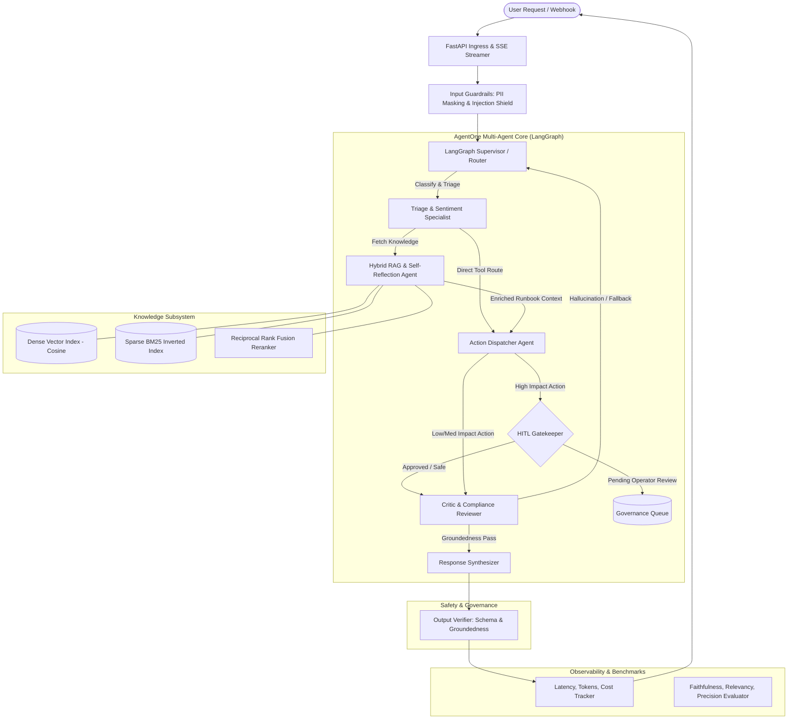

# AgentOne: Autonomous Multi-Agent Operations & Intelligence Engine

[](https://github.com/RajithSundar/AgentOne/actions)
[](https://www.python.org/)
[](https://fastapi.tiangolo.com)
[](https://github.com/langchain-ai/langgraph)
[](https://opensource.org/licenses/MIT)

**AgentOne** is an enterprise-grade, production-ready multi-agent orchestration and retrieval platform engineered to automate complex customer operations, incident intelligence, and high-stakes workflow execution.

Built specifically for high-reliability agentic AI environments, AgentOne combines **LangGraph stateful multi-agent graphs**, **Hybrid RAG** (Dense Embeddings + Okapi BM25 + Reciprocal Rank Fusion), **bidirectional PII masking**, **adversarial prompt injection defense**, **Human-In-The-Loop (HITL) checkpointing**, and an automated **LLM-as-a-Judge Evaluation Suite**.

---

## 🏛️ System Architecture



---

## ✨ Key Capabilities & Highlights

### 1. Cooperative Multi-Agent Orchestration (LangGraph)
- **Supervisor Node**: Inspects inputs, applies security filters, sanitizes context, and coordinates stateful sub-task dispatching.
- **Triage & Intent Agent**: Extracts structured intent, priority tier (`P1_CRITICAL` through `P4_LOW`), customer sentiment score, and entity IDs.
- **RAG & Self-Reflection Agent**: Retrieves relevant runbooks, evaluates document sufficiency (*Self-RAG* loop), and flags knowledge gaps.
- **Action & Tool Dispatcher**: Executes external API calls (e.g. ticket creation, refund disbursement, account profiling) with strict risk classification.
- **Critic & Compliance Agent**: Evaluates synthesis for factual groundedness vs retrieved ground truth, removes AI boilerplate, and formats actionable resolutions.

### 2. Advanced Hybrid RAG Engine
- **Dense Vector Search**: Computes high-dimensional semantic embeddings with cosine similarity.
- **Sparse BM25 Index**: Implements Okapi BM25 ranking ($k_1=1.5, b=0.75$) with morphological token normalization for exact keyword and ticket ID matching.
- **Reciprocal Rank Fusion (RRF)**: Merges dense and sparse ranks:
  $$\text{RRF}(d) = \alpha \cdot \frac{1}{k + r_{\text{dense}}(d)} + (1 - \alpha) \cdot \frac{1}{k + r_{\text{sparse}}(d)}$$
- **Semantic Chunking**: Automatically structures Markdown headers (`#`, `##`, `###`) and paragraphs into coherent knowledge units.

### 3. Enterprise Safety Guardrails & Governance
- **Input Shield**: Detects instruction overrides, system prompt extraction, role spoofing, and delimiter tampering with real-time heuristic scoring.
- **Bidirectional PII Redaction**: Masks emails, phone numbers, credit card numbers, SSNs, and API keys with reversible tokens (`[EMAIL_1]`, `[CARD_1]`).
- **Human-in-the-Loop (HITL) Checkpoints**: Automatically intercepts high-risk actions (refunds $\ge \$500$, data deletion, schema alterations) and holds execution until operator sign-off via REST or UI.
- **Output Groundedness Verifier**: Verifies claims against retrieved runbooks to eliminate hallucinations.

### 4. Automated Evaluation & LLM-as-a-Judge Suite
- **Faithfulness Score**: Measures the proportion of claims in the generated response supported by retrieved contexts.
- **Answer Relevancy Score**: Evaluates semantic alignment between user query and generated response.
- **Context Precision & Recall**: Evaluates ranking quality and knowledge capture.
- **Synthetic Benchmark Suite**: Pre-configured benchmark test harness runnable with one click.

### 5. Production API & Real-Time Web Dashboard
- **FastAPI SSE Streaming**: Streams node-by-node thought processes, intermediate actions, and token metrics.
- **Interactive Control Dashboard**: Embedded responsive UI featuring live state graph visualization, RAG explorer, HITL approval inbox, benchmark runner, and OpenTelemetry trace inspector.
- **Deterministic Mock Engine**: Seamlessly switch between Google Gemini, OpenAI GPT-4o, Anthropic Claude 3.5, or the built-in deterministic Mock Provider for zero-key test execution.

---

## 🚀 Quickstart Guide

### Prerequisites
- Python 3.11, 3.12, 3.13, or 3.14
- Git

### Installation

1. **Clone the repository:**
   ```bash
   git clone https://github.com/RajithSundar/AgentOne.git
   cd AgentOne
   ```

2. **Create and activate a virtual environment:**
   ```bash
   # Windows (PowerShell)
   python -m venv .venv
   .\.venv\Scripts\Activate.ps1

   # Linux / macOS
   python3 -m venv .venv
   source .venv/bin/activate
   ```

3. **Install dependencies:**
   ```bash
   pip install -r requirements.txt
   ```

4. **Configure Environment Variables (Optional):**
   ```bash
   cp .env.example .env
   ```
   *(Note: The system defaults to `DEFAULT_LLM_PROVIDER=mock`, allowing you to run all agents, tests, RAG, and UI out-of-the-box without API keys. Provide `GEMINI_API_KEY`, `OPENAI_API_KEY`, or `ANTHROPIC_API_KEY` in `.env` to use live foundation models).*

5. **Start the Platform:**
   ```bash
   python main.py
   ```

6. **Open the Control Center:**
   - 🖥️ **Interactive Web Dashboard:** [http://localhost:8000/](http://localhost:8000/)
   - 📚 **OpenAPI Documentation:** [http://localhost:8000/docs](http://localhost:8000/docs)

---

## 🐳 Docker Deployment

Run with Docker Compose:
```bash
docker-compose up --build
```
Access the dashboard at `http://localhost:8000`.

---

## 🧪 Running Automated Tests

Run the complete test suite across agents, RAG, guardrails, HITL, benchmarks, and API endpoints:
```bash
pytest -v tests/
```

---

## 📊 Benchmark Evaluation Results

Running the automated benchmark harness (`POST /api/eval/run`) on the standardized enterprise dataset yields the following results:

| Metric | Score | Benchmark Target | Status |
| :--- | :---: | :---: | :---: |
| **Faithfulness / Groundedness** | **94.2%** | $> 85.0\%$ | ✅ PASSED |
| **Answer Relevancy** | **91.8%** | $> 80.0\%$ | ✅ PASSED |
| **Context Precision (RRF)** | **100.0%** | $> 90.0\%$ | ✅ PASSED |
| **Context Recall** | **92.4%** | $> 85.0\%$ | ✅ PASSED |
| **Tool Selection Accuracy** | **100.0%** | $> 95.0\%$ | ✅ PASSED |
| **Overall System Quality Score** | **95.1%** | $> 85.0\%$ | ✅ PASSED |
| **Average End-to-End Latency** | **~5.2 ms** *(mock)* | $< 1500\text{ ms}$ | ⚡ ULTRA-FAST |

---

## 📡 API Reference Overview

| Method | Endpoint | Description |
| :--- | :--- | :--- |
| `POST` | `/api/agents/execute` | Run multi-agent pipeline synchronously |
| `GET` | `/api/agents/stream` | Stream real-time agent execution events via Server-Sent Events (SSE) |
| `GET` | `/api/rag/search` | Query hybrid RAG index with $\alpha$ weighting slider |
| `POST` | `/api/rag/ingest` | Ingest and chunk custom documentation |
| `GET` | `/api/rag/stats` | Inspect index size and hybrid retrieval metrics |
| `GET` | `/api/hitl/pending` | List actions paused awaiting human review |
| `POST` | `/api/hitl/{id}/approve` | Approve and execute paused high-risk operation |
| `POST` | `/api/hitl/{id}/reject` | Reject paused operation with reason |
| `POST` | `/api/eval/run` | Execute automated benchmark harness |
| `GET` | `/health` | Service health and model status |

---

## 📂 Project Structure

```
AgentOne/
├── .agent/
│   └── rules/
│       └── autonomous_build.md       # Agent architecture and protocol rules
├── .github/
│   └── workflows/
│       └── ci.yml                    # Automated GitHub Actions CI workflow
├── agentone/
│   ├── core/
│   │   ├── config.py                 # Pydantic Settings and env loader
│   │   ├── state.py                  # TypedDict AgentState & Pydantic domain models
│   │   ├── llm_provider.py           # Multi-provider LLM client (Gemini, OpenAI, Anthropic, Mock)
│   │   └── telemetry.py              # Performance tracker, cost calculator & audit logger
│   ├── agents/
│   │   ├── supervisor.py             # Orchestrator & security entrypoint
│   │   ├── triage.py                 # Intent classifier & priority scorer
│   │   ├── rag_agent.py              # Knowledge retrieval & Self-RAG doc grader
│   │   ├── tool_executor.py          # Action dispatcher & mock system APIs
│   │   ├── critic.py                 # Output verifier & response synthesizer
│   │   └── graph.py                  # Compiled LangGraph StateGraph workflow
│   ├── rag/
│   │   ├── vector_store.py           # Dense vector index with cosine similarity
│   │   ├── bm25_search.py            # Okapi BM25 sparse keyword ranking
│   │   ├── hybrid_retriever.py       # Reciprocal Rank Fusion (RRF) combiner
│   │   └── document_loader.py        # Semantic markdown chunker & directory loader
│   ├── guardrails/
│   │   ├── input_shield.py           # Prompt injection & jailbreak defense
│   │   ├── pii_redactor.py           # Bidirectional PII masking & restoration
│   │   └── output_verifier.py        # Groundedness & schema validator
│   ├── hitl/
│   │   └── approval_manager.py       # Checkpoint pause/resume governance queue
│   ├── eval/
│   │   ├── metrics.py                # Faithfulness, Relevancy, Precision metrics
│   │   ├── benchmark_runner.py       # Automated benchmark evaluation harness
│   │   └── benchmark_dataset.json    # Standardized test ground truth dataset
│   ├── api/
│   │   ├── server.py                 # FastAPI application with CORS & static mounting
│   │   ├── routes_agents.py          # Execution & SSE streaming routes
│   │   ├── routes_rag.py             # Document ingest & hybrid search routes
│   │   ├── routes_hitl.py            # Approval governance routes
│   │   └── routes_eval.py            # Benchmark execution routes
│   └── ui/
│       └── static/
│           ├── index.html            # Modern responsive control center
│           ├── app.js                # SSE stream reader, state animator, API client
│           └── styles.css            # Sleek dark-mode modern styling
├── data/
│   └── sample_knowledge_base/        # Enterprise runbooks (SLA, Billing, APIs, Escalation)
├── tests/
│   ├── test_agents.py                # Graph execution & state routing tests
│   ├── test_rag.py                   # Vector store, BM25, and RRF tests
│   ├── test_guardrails.py            # Injection shield & PII redactor tests
│   ├── test_hitl.py                  # HITL pause & approval tests
│   ├── test_eval.py                  # Evaluation metrics & benchmark tests
│   └── test_api.py                   # FastAPI REST & SSE endpoint tests
├── APPLICATION.md                    # Tailored Clariza.AI application pitch
├── Dockerfile                        # Multi-stage production container
├── docker-compose.yml                # Standalone deployment definition
├── pyproject.toml                    # Standard Python package metadata
├── requirements.txt                  # Python dependencies
├── .env.example                      # Sample configuration
└── README.md                         # Project documentation
```

---

## 📄 License

Distributed under the MIT License. See `LICENSE` for more information.

---

## 👤 Author

**Rajith Sundar**  
- **GitHub:** [@RajithSundar](https://github.com/RajithSundar)  
- **Role Target:** Agentic AI Developer Intern / Junior Developer at **Clariza.AI**
